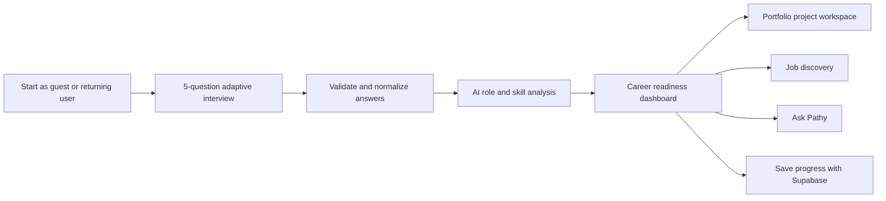
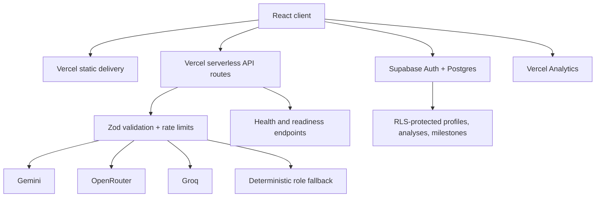

# PathFinder AI

### An AI career discovery companion for Indonesian tech talent

[](https://pathfinder-ai-lyart.vercel.app)
[](https://react.dev/)
[](https://ai.google.dev/)
[](https://supabase.com/)
[](https://vercel.com/)

**PathFinder AI turns scattered experience into a practical career direction.** It interviews users about what they have built, what kind of work keeps them engaged, where they want to work, and what is currently holding them back. The result is not a generic personality label. It is a focused career report with reachable roles, evidence-based skill gaps, a portfolio project, a 90-day roadmap, and relevant job-search paths.

The product is designed primarily for Indonesian students, fresh graduates, career switchers, and self-taught builders who have useful technical experience but struggle to translate it into a clear role, portfolio, and application strategy.

> Built for **#JuaraVibeCoding**, using Gemini, Google AI Studio, and a production-oriented React + serverless architecture.

## Try It

**Production:** [pathfinder-ai-lyart.vercel.app](https://pathfinder-ai-lyart.vercel.app)

The core analysis can be completed as a guest. Authentication is optional and is used to preserve analysis history and project progress.

## The Problem

Early-career candidates rarely lack ambition. They lack a clear translation layer between what they have done and what employers are looking for.

A student may say:

- "I helped clean a messy sales spreadsheet."
- "I built a simple network detection system."
- "I made a short animation in Blender."
- "I redesigned an application flow in Figma."

Those stories contain real signals, but traditional job boards expect role names, skill keywords, portfolios, and confidence about where to apply. PathFinder closes that gap by turning informal experience into a structured, actionable career plan.

## What PathFinder Delivers

After a short bilingual interview, PathFinder produces:

- **Role matching** based on demonstrated tools, projects, and preferred work
- **Readiness score** that summarizes the user's current preparation
- **Signal chips** that reflect evidence found in the user's own answers
- **Skill-gap analysis** prioritized around the recommended role
- **A targeted portfolio project** with tools, milestones, and expected outcomes
- **A 7/30/60/90-day roadmap** that converts advice into a sequence of actions
- **Job discovery links** relevant to the role and location
- **Pathy**, an AI career assistant that can explain recommendations and suggest next steps
- **Progress persistence** through Supabase authentication and per-user records
- **English and Bahasa Indonesia support** across the primary flow

## Product Flow



The interview is intentionally short. It asks for evidence instead of abstract self-assessment:

1. Who are you?
2. What have you actually built or helped finish?
3. Which part of that work keeps you engaged?
4. Where do you want to work?
5. When do you want to apply, and what is your main challenge?

This gives the model enough context to distinguish between profiles such as frontend engineering, data analysis, UI/UX, backend engineering, cybersecurity, and 3D/motion work.

## What Makes It Different

### 1. Proof-of-work before job titles

PathFinder does not begin by asking users to choose a career from a dropdown. It starts with what they have already done, even when they do not yet know the professional name for that work.

### 2. Advice becomes a portfolio artifact

Every recommendation is paired with a concrete project. A cybersecurity recommendation may lead to a network traffic detection lab; a 3D profile may receive a short Blender portfolio film; a data profile may receive a cohort dashboard.

### 3. Resilient multi-provider AI

The application does not rely on a single model provider. Its server-side routing attempts:

```text
Gemini -> OpenRouter -> Groq -> deterministic domain fallback
```

If one provider reaches a quota limit or becomes temporarily unavailable, PathFinder can continue producing a useful response. The final deterministic fallback uses explicit role taxonomy rules rather than defaulting every profile to web development.

### 4. Honest job-data states

The interface distinguishes between:

- **Grounded search results** produced with search-capable AI
- **AI-curated listings** that should be treated as discovery suggestions
- **Deterministic fallback examples** shown when external providers are unavailable

Fallback records are marked as samples and lead users to live searches on established job platforms instead of pretending to be guaranteed open vacancies.

## Architecture



### Frontend

- React 19 and React Router
- Vite and TypeScript
- Tailwind CSS
- Motion for transitions
- Sonner for user feedback
- Lazy-loaded result and workspace routes
- Responsive bilingual interface

### Serverless API

- TypeScript API handlers under `/api/v1`
- Gemini structured generation
- OpenRouter and Groq provider failover
- Zod request validation
- Configurable timeouts and rate limits
- SHA-256 analysis cache keys
- Bounded in-memory response cache
- Request IDs and security headers

### Data and Authentication

- Supabase Google OAuth and email magic links
- Postgres persistence for users, analyses, and milestones
- Row Level Security policies that isolate each user's records
- Indexed analysis and cache lookup fields
- Guest sessions remain usable without requiring authentication

## Repository Structure

```text
pathFinderAI/
├── api/                      # Vercel serverless API
│   ├── _lib/pathfinder.ts    # AI routing, validation, caching, fallbacks
│   └── v1/                   # Analysis, chat, conversation, health routes
├── frontend/src/
│   ├── components/           # Dashboard, jobs, chat, and save UI
│   ├── hooks/                # Analysis workflow hooks
│   ├── screens/              # Home, interview, loading, results, workspace
│   └── utils/                # API, validation, and Supabase clients
├── supabase/schema.sql       # Tables, indexes, and RLS policies
├── backend/                  # Experimental FastAPI/JobSpy reference service
├── server.ts                 # Express runtime for local/Cloud Run operation
├── vercel.json               # Vercel routes, headers, and function limits
└── .env.example              # Environment variable template
```

The production Vercel path uses the Vite frontend and `/api` serverless functions. The Python service in `/backend` is retained as an experimental/reference implementation for future job aggregation work; it is not required for the standard Vercel deployment.

## API Surface

| Method | Endpoint | Purpose |
| --- | --- | --- |
| `POST` | `/api/v1/conversation/question` | Generate the adaptive interview question |
| `POST` | `/api/v1/analysis` | Produce role, skill-gap, project, roadmap, and job analysis |
| `POST` | `/api/v1/chat` | Continue the conversation with Pathy |
| `GET` | `/api/v1/health` | Lightweight process health check |
| `GET` | `/api/v1/ready` | Report configured AI and data dependencies |

## Reliability and Security

Production safeguards currently include:

- Server-side AI keys; provider secrets are never exposed through `VITE_*`
- Strict request schemas and input-length limits through Zod
- Separate API and AI rate-limit controls
- AI call timeouts to avoid hanging serverless requests
- Automatic provider failover
- Safe deterministic output when every AI provider fails
- CORS allow-list support
- `nosniff`, referrer, and frame security headers
- Supabase Row Level Security
- Per-user database policies and cascading cleanup
- Health/readiness endpoints for deployment verification
- Vercel Analytics for production usage visibility

For larger-scale production traffic, the in-memory rate-limit and cache layers should be moved to a shared store such as Upstash Redis so limits remain consistent across serverless instances.

## Run Locally

### Prerequisites

- Node.js 20+
- npm
- At least one supported AI provider key
- A Supabase project for authentication and persistence

### Installation

```bash
git clone https://github.com/haziqdafren/pathFinderAI.git
cd pathFinderAI
npm install
cp .env.example .env.local
npm run dev
```

Open the local URL printed by the development server.

### Required environment variables

```bash
GEMINI_API_KEY=
VITE_SUPABASE_URL=
VITE_SUPABASE_ANON_KEY=

APP_URL=http://localhost:3000
CORS_ORIGINS=http://localhost:3000,http://localhost:5173
VITE_PREVIEW_AUTH_BYPASS=false
```

### Recommended production controls

```bash
API_RATE_LIMIT_PER_MIN=120
AI_RATE_LIMIT_PER_MIN=12
AI_TIMEOUT_MS=9000
ANALYSIS_CACHE_TTL_MS=1800000
```

### Optional AI failover

```bash
OPENROUTER_API_KEY=
GROQ_API_KEY=
```

Never commit real secrets. Variables beginning with `VITE_` are included in the browser bundle and must only contain public client configuration, such as a Supabase anon key.

## Configure Supabase

1. Create a Supabase project.
2. Run [`supabase/schema.sql`](./supabase/schema.sql) in the SQL editor.
3. Enable Google and/or email authentication.
4. Add your deployment URL as the Auth Site URL.
5. Add `/auth/callback` as an allowed redirect.
6. Copy the project URL and anon key into the environment variables.

The schema includes:

- `users`
- `analyses`
- `job_cache`
- `milestones`
- supporting indexes
- user-scoped RLS policies

## Quality Checks

Run these before deployment:

```bash
npm run lint
npm run build
npm audit --audit-level=moderate
```

Useful production smoke checks:

```bash
curl https://your-domain.com/api/v1/health
curl https://your-domain.com/api/v1/ready
```

Key flows to verify:

- Indonesian and English onboarding
- Data, frontend, UI/UX, backend, cybersecurity, and 3D/animation profiles
- Vague or irrelevant input handling
- Guest analysis and result export
- Google OAuth and magic-link callbacks
- Saved analysis retrieval
- Settings, logout, project rotation, job links, and Pathy chat

## Deploy to Vercel

1. Import this repository into Vercel.
2. Use `npm run build` as the build command.
3. Use `dist` as the output directory.
4. Add the production environment variables.
5. Configure the final Vercel domain in Supabase Auth.
6. Deploy and verify `/api/v1/health` and `/api/v1/ready`.

The included [`vercel.json`](./vercel.json) configures SPA rewrites, serverless function limits, and baseline security headers.

## #JuaraVibeCoding Fit

PathFinder was shaped around the event's three-part assessment:

### Problem

It addresses a real gap faced by Indonesian early-career tech talent: translating informal project experience into credible career direction and a practical application plan.

### Solution

The product offers an end-to-end flow rather than a single AI prompt: adaptive discovery, structured analysis, role matching, portfolio planning, progress tracking, and job exploration.

### Uniqueness

PathFinder treats AI as an accountable career reasoning layer. It exposes signals, gaps, projects, roadmaps, and data states instead of returning a vague motivational paragraph. The bilingual experience and provider-resilient architecture are built for the realities of its audience.

## Roadmap

- Shared Redis-backed cache and distributed rate limiting
- Verified job-provider integrations with freshness metadata
- Expanded Indonesian role taxonomy
- Recruiter-facing portfolio review links
- Progress reminders and milestone analytics
- Evaluation dataset for measuring role-matching quality

## Author

Built by **Haziq Dafren** as an AI-assisted product engineering project for **#JuaraVibeCoding**.

- GitHub: [@haziqdafren](https://github.com/haziqdafren)
- Repository: [haziqdafren/pathFinderAI](https://github.com/haziqdafren/pathFinderAI)
- Live product: [PathFinder AI](https://pathfinder-ai-lyart.vercel.app)

---

If PathFinder helps you see a clearer route from "I built something" to "this is the role I can pursue," then it is doing its job.
